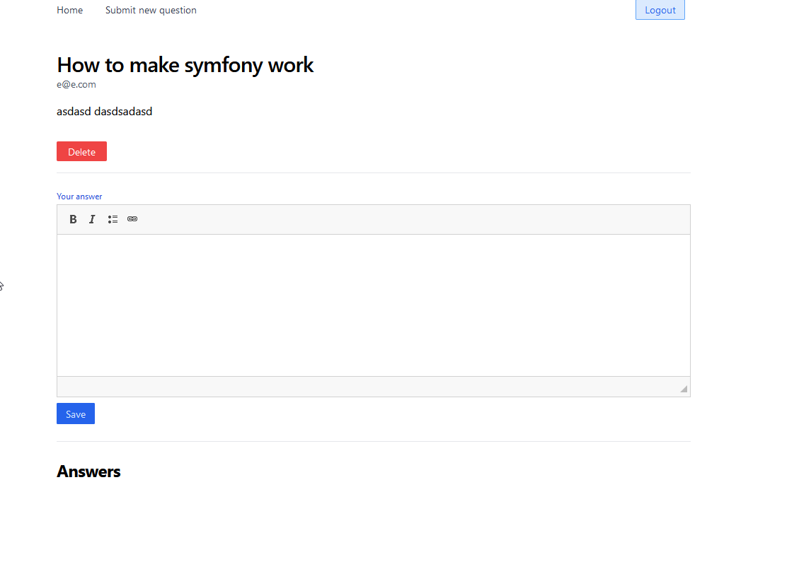
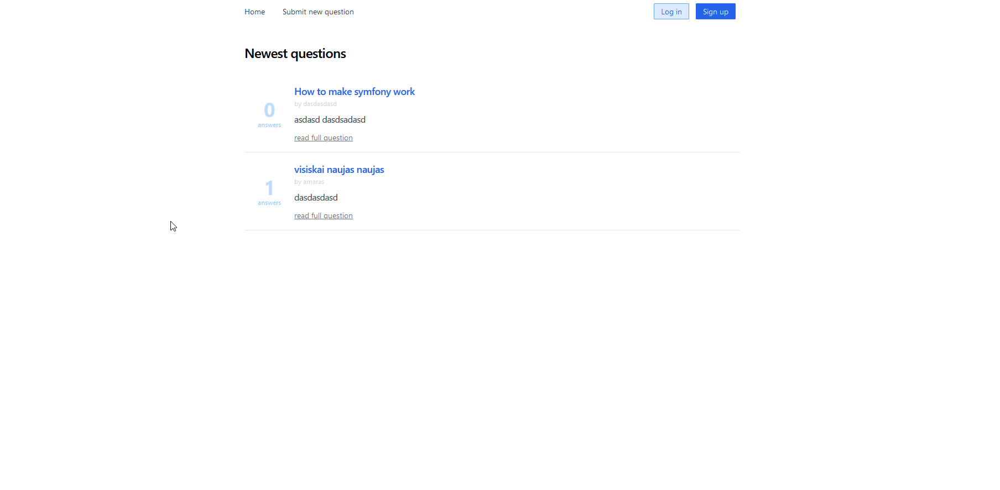

#  Mini stackoverflow app

Demo app, built with Symfony 5  and PHP 8.

---

## Features
* [x] Only registered users can create question
* [x] User can create/delete questions
* [x] User can answer questions
* [x] User can vote question up/down

---

## Screenshots

    
    

